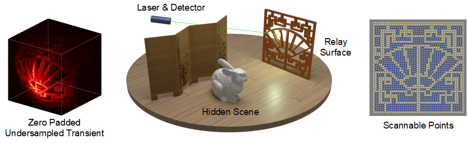
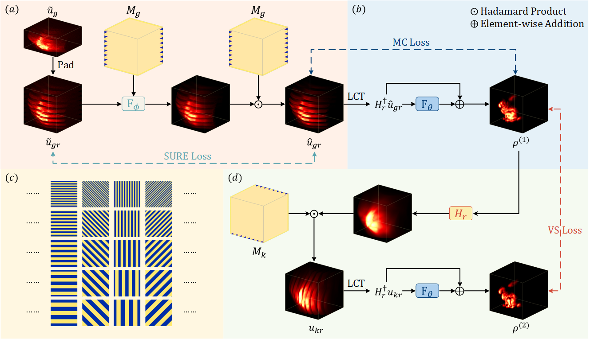
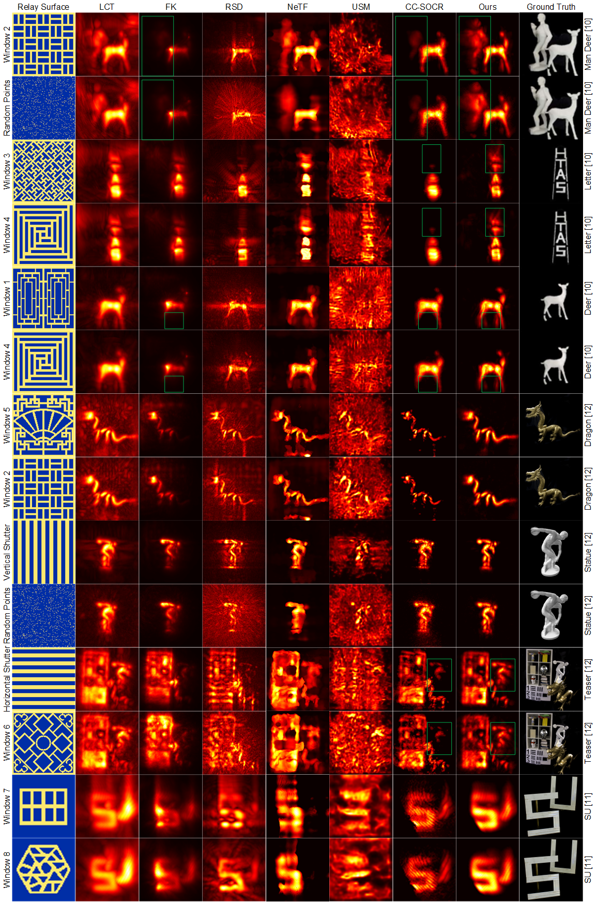

# Virtual-Scanning-NLOS
The code for Paper: Virtual Scanning: Unsupervised Non-line-of-sight Imaging from Irregularly Undersampled Transients in NIPS 2024.[Paper](https://proceedings.neurips.cc/paper_files/paper/2024/file/c58437945392cec01e0c75ff6cef901a-Paper-Conference.pdf)

# Illustration of task


# Pipeline


# Results on real-world datasets


# Inference 
1. The pre-trained models for the 256×128×128 test size are provided in './checkpoint'
2. Download pre-processed real-world datasets provided by [F-K](https://github.com/princeton-computational-imaging/NLOSFeatureEmbeddings/blob/main/README.md) and [NLOST](https://github.com/Depth2World/NLOST?tab=readme-ov-file) from [Google Drive](https://drive.google.com/file/d/12PpcjcT3yMYrZ740MniDX-e5hAsxqGTe/view?usp=sharing)
3. Launch './test.sh'
   
To test our method on more patterns and datasets, please change the `data_path` or `pattern_path` in the following command. For sparse patterns, we recommend setting a lower SNR for better results.

```bash
python test.py --snr 5.e+4 --data_path 'test_data/real_data/nlost/mandeer2_re_160s' --pattern_path 'test_data/pattern/random.png'
```
# Contact
Questions can be addressed to [Xingyu Cui](xingyu_cui@tju.edu.cn).

# Citation
If you find it is useful, please cite
```
@inproceedings{cui2024virtual,
  title={Virtual Scanning: Unsupervised Non-line-of-sight Imaging from Irregularly Undersampled Transients},
  author={Cui, Xingyu and Yue, Huanjing and Li, Song and Yin, Xiangjun and Hou, Yusen and Meng, Yun and Zou, Kai and Hu, Xiaolong and Yang, Jingyu},
  booktitle={The Thirty-eighth Annual Conference on Neural Information Processing Systems},
  year={2024}
}
```
